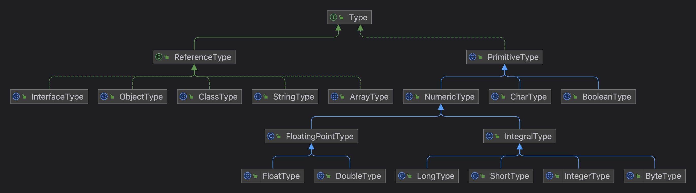

# Stanislav Skorobogatov

OOP Task

Technologies used:
* Java 17
* Lombok
* Maven

The class hierarchy is as follows:

You can open the project in your IDE.
The task implementation can be found in the src/main/java/org/projects/development directory.